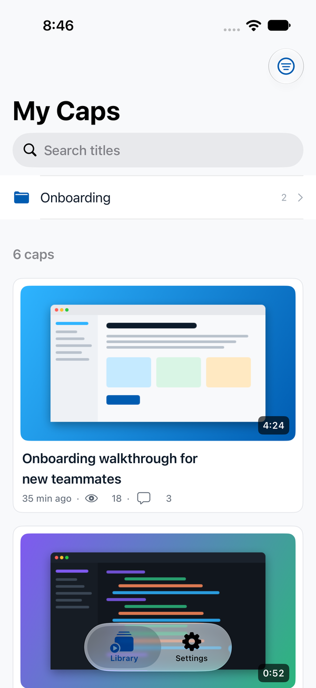
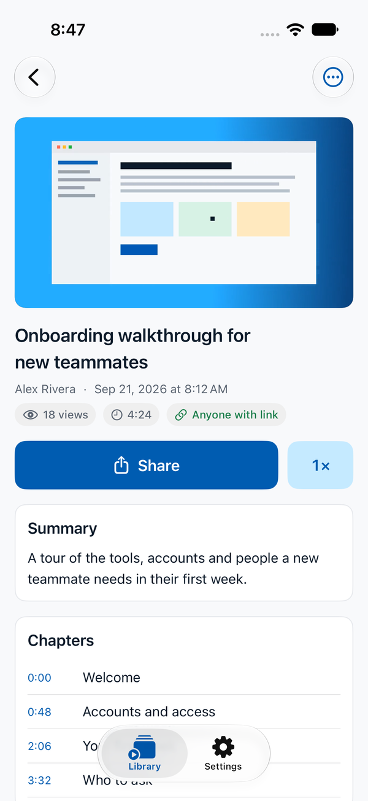
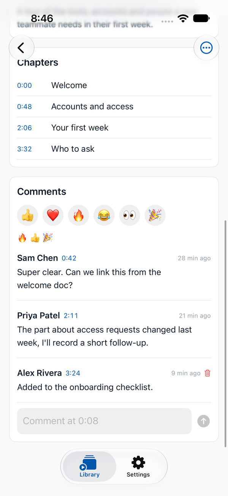
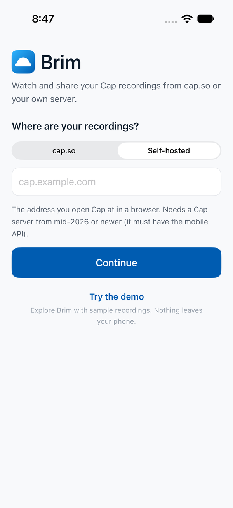

<p align="center">
  
</p>

<h1 align="center">Brim</h1>

<p align="center">
  An unofficial, native iOS viewer for <a href="https://cap.so">Cap</a> recordings.<br>
  Works with cap.so <b>and any self-hosted Cap server</b>.
</p>

<p align="center">
  
  
  
  <a href="LICENSE"></a>
</p>

---

Cap is a great open-source screen recorder, and you can host it yourself. What
you could not do is open your recordings on your phone in a real app if you
self-host: Cap's own iOS app talks to cap.so only. Brim fills that gap. Point
it at your server, sign in, and your library is there: watch, share, comment.

Brim does not record. It is a viewer.

<p align="center">
  
  
  
  
</p>

<p align="center"><sub>Shown with the built-in demo library. The screenshots are taken by a UI test, never from a real account.</sub></p>

> **Not affiliated with Cap.** Brim is an independent project. It is not
> endorsed by, sponsored by, or connected to Cap Software, Inc. "Cap" is a
> trademark of Cap Software, Inc. Cap's server is open source (AGPL-3.0) at
> [CapSoftware/Cap](https://github.com/CapSoftware/Cap). Brim is a separate,
> clean-room client written against the server's HTTP API and shares no code
> or assets with it.

## Features

- **Any server.** cap.so or your own domain. Keep several accounts side by
  side and switch between them.
- **Sign in your way.** A six-digit email code, or the server's own login page
  (Google, Apple or SSO where the server offers them) inside an in-app browser
  sheet.
- **Library.** Your caps, every shared space and organization, folders,
  search, pull to refresh, infinite scroll, thumbnails and processing status.
- **Native player.** `AVPlayer` with mp4 and HLS, playback speed, Picture in
  Picture, AirPlay, chapters, and comments that jump to their timestamp.
- **Share.** System share sheet, copy link, open in browser.
- **Manage your own caps.** Rename, public or private, set or remove a share
  password, download the file, per-cap analytics, delete.
- **Talk back.** Comments and emoji reactions posted at the current playback
  time.
- **Try it without an account.** "Try the demo" on the sign-in screen opens a
  sample library that runs entirely on the phone, so you can look around
  before pointing Brim at a server.
- **Private by design.** No analytics, no tracking, no third-party services.
  Keys live in the iOS Keychain and never sync off the device.

## Requirements

- iOS or iPadOS 17 or later.
- A Cap account on cap.so, or a self-hosted Cap server that:
  - runs a web build from mid-2026 or newer (it needs Cap's mobile API at
    `/api/mobile`; Brim tells you at sign-in if the server is too old), and
  - has a storage endpoint the phone can reach. Videos and thumbnails are
    served straight from your bucket through short-lived signed URLs.

## Install

Brim is not on the App Store. Build it yourself; it takes a few minutes.

```sh
git clone https://github.com/justingluska/brim.git
cd brim
brew install xcodegen
DEVELOPMENT_TEAM=YOURTEAMID xcodegen generate   # your 10-character Apple team ID
open Brim.xcodeproj
```

Pick your iPhone and press Run. If you skip `DEVELOPMENT_TEAM`, choose a team
under Signing & Capabilities in Xcode instead. With a free Apple ID the app
runs for seven days before it needs a rebuild; a paid developer account signs
it for a year. You will also want your own bundle identifier: change
`PRODUCT_BUNDLE_IDENTIFIER` in `project.yml`.

## Good to know

- **One mobile session per user.** Cap keeps a single mobile key per account
  per server. Signing in with Brim signs the official Cap iOS app out of the
  same account, and the other way round.
- **Fresh desktop recordings** are served through a browser-only playlist
  until the server finishes them. Brim shows "still finalizing" for the minute
  or so that takes.
- **Password-protected caps** you do not own are not available through Cap's
  mobile API, so Brim cannot open them.
- The mobile API is Cap's internal API for its own app. It is undocumented and
  can change with a server upgrade. If something breaks after you update your
  server, please open an issue.

## How it works

```
Brim/                 SwiftUI app: views, session store, theme
Packages/CapKit/      Foundation-only client for Cap's mobile API, with tests
BrimTests/            App-target unit tests
ci_scripts/           Xcode Cloud post-clone hook (XcodeGen + version stamp)
docs/                 API notes, privacy, release notes, icon generator
project.yml           XcodeGen spec (the .xcodeproj is generated, not committed)
```

`CapKit` has no UIKit or SwiftUI dependency, so it builds and tests anywhere
Swift runs, Linux included:

```sh
cd Packages/CapKit && swift test
```

Its fixtures are real responses from a self-hosted server with every
identifier, name, title and signature replaced. The endpoints Brim uses, and
the two quirks worth knowing about (dropping the bearer header on redirects to
storage, and refreshing signed playback URLs), are written up in
[docs/api.md](docs/api.md).

## Contributing

Issues and pull requests are welcome. See [CONTRIBUTING.md](CONTRIBUTING.md).
Good first things: iPad split view, captions from `transcriptUrl`, a share
extension, localizations.

## Privacy

Brim talks only to the Cap server you sign in to and to the storage URLs that
server hands back. Details in [docs/privacy.md](docs/privacy.md).

## License

[MIT](LICENSE). The Brim name and mark are this project's own; please pick a
different name and icon if you distribute a modified build.
